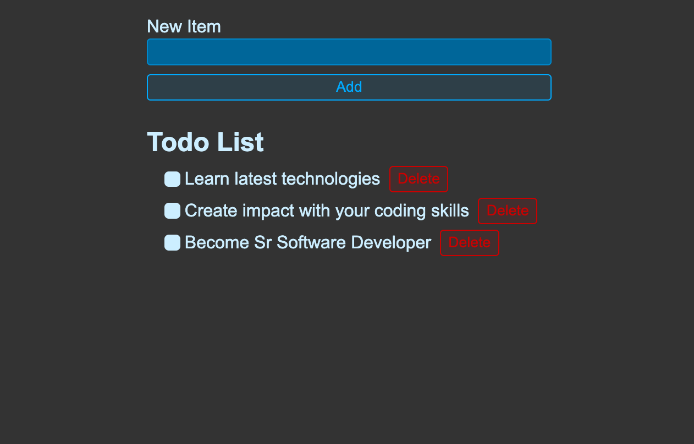

# React ToDo List App

A minimalistic ToDo list app built with React to help you manage your tasks efficiently.

## Features

- Add, edit, and delete tasks
- Mark tasks as completed
- Simple and intuitive user interface
- Responsive design for various screen sizes

## Technologies Used

- React
- JavaScript (ES6+)
- CSS (Styled Components for styling)
- Local Storage for data persistence